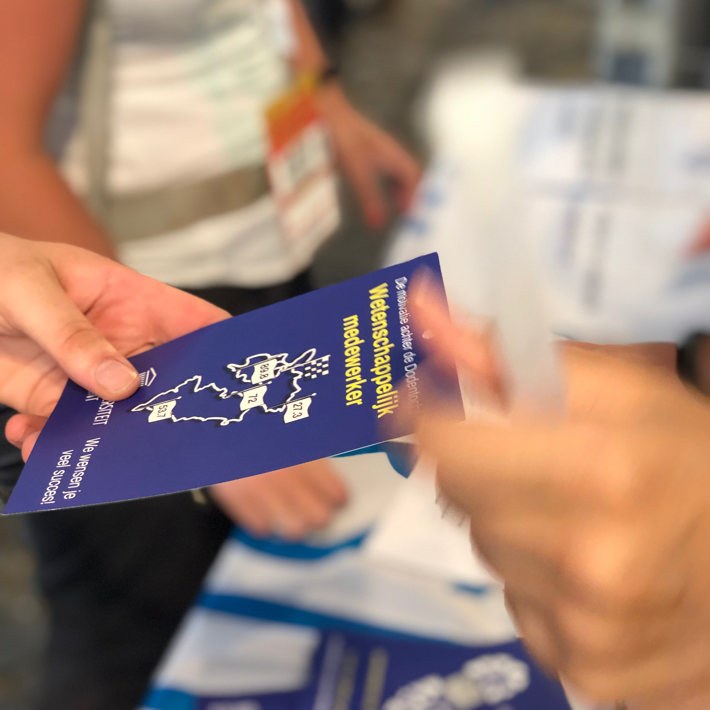
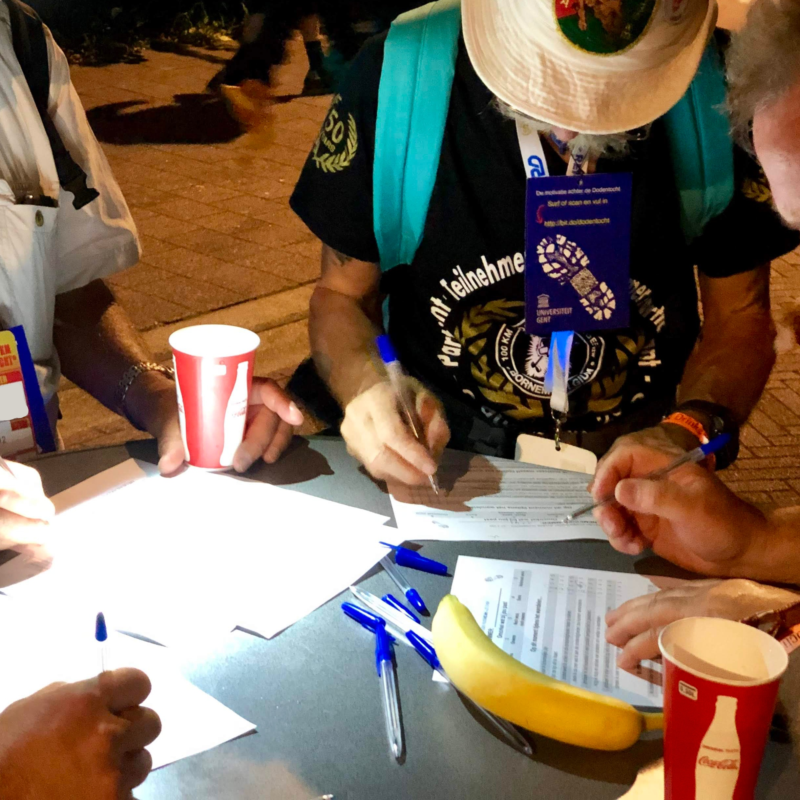
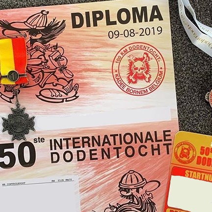

<style>
/* Whole document: */
body{
  font-size: 12pt;
  font-color: black;
}
div.blue { background-color:#eaeded; border-radius: 5px; padding: 20px;}
</style>

<script>
   $(document).ready(function() {
     $head = $('#header');
     $head.prepend('')
   });
</script>

```{r setup, include=FALSE}
knitr::opts_chunk$set(echo = TRUE)
#library(epuRate)
library(rmarkdown)
library(dplyr)
library(forcats)
library(ggridges)
library(devtools)
library(ggthemr)
library(foreign)
library(psych)
library(ggplot2)
library(nlme) #for mixed effects models
library(reghelper) 
library(ggthemes)
library(gridExtra)
library(grid)
library(ggplot2)
library(lattice)
library(circlize)
library(plotrix)
```

> "De grootheid van een mens is niet te meten aan zijn verwezenlijkingen, maar aan zijn aspiraties..."  
- *Een wandelaar na zijn opgave in 1981*.


# Welkom
***
Welkom op de resultatenpagina van de Dodentochtstudie.

Via deze webpagina wensen we u op de hoogte te brengen van alle (eerste) resultaten die volgen uit de Dodentochtstudie (augustus, 2019). In deze **eerste update** bespreken we de volgende vragen:

  1. Wie waren onze deelnemers?
  2. Hoe waren ze gemotiveerd om deel te nemen aan de Dodentocht?
  3. Wat mag u nog verwachten?

Meer informatie over de studie kan u steeds terugvinden op <a href="https://www.ugent.be/epg/nl/onderzoek/dodentocht-nl" target="_blank">de onderzoekspagina</a>

<br><br>

# 1. De deelnemers
***

<div class = "row">
<div class = "col-md-6">

```{r echo=FALSE, message=FALSE, warning=FALSE,fig.height=7}
# Pie Chart with Percentages

data <- read.spss("/Users/joachimwaterschoot/Downloads/PRE_TIJDENS_POST_doto_EM1.sav",
                  use.value.labels = FALSE,
                  to.data.frame=TRUE)

dataa <- data[,c('Age','Gender')]
dataa$Gender <- round(dataa$Gender, digits = 0)
dataa <- na.omit(dataa)
library(dplyr)
df <- dataa %>%
  group_by(Gender,Age) %>%
  summarise(counts = n())
colnames(df) <- c('Geslacht','Leeftijd','Hoeveelheid')
df$Geslacht <- as.factor(df$Geslacht)
df[which(df$Geslacht=="2"),'Geslacht'] <- "1"
df$Geslacht <- droplevels(df$Geslacht)
levels(df$Geslacht) <- c('mannen 60%','vrouwen 40%')

ggthemr("flat")
library(ggpubr)
ggplot(df, aes(x = Leeftijd))+
geom_area(aes(fill = Geslacht), color = "white",
              stat ="bin", bins = 30) +
  labs(
    x = "Leeftijd",
    y = "Aantal deelnemers",
    title = "Leeftijd van deelnemers per geslacht",
    subtitle = "Totale aantal = 1383 (10.91% van alle wandelaars)",
    caption = "Bron: Dodentochtstudie, Universiteit Gent"
  )+
  theme_classic()+
  coord_cartesian(ylim=c(0,120))+
  scale_fill_manual(values = c("#2F3C4D", "black")) +
  theme(plot.caption = element_text(color = "black", size = 13),text=element_text(size=20,  family="PT Sans Narrow"),legend.position="top")

```

Gemiddeld hadden deelnemers een leeftijd van **43.4** jaar, gaande van 18 tot 77 jaar. Er deden meer mannen dan vrouwen mee aan het onderzoek.
</div>
<div class = "col-md-6">
```{r echo=FALSE, message=FALSE, warning=FALSE,fig.height=7}

value <- c("100 %",  "98.3 %",  "87.9 %",   "83.8 %",  "82.4 %")
hoeveelheid <- as.numeric(c( 1383,   1360,    1215,     1159,   1139      ))
post <- c('Start','27.3 km',  '53.7 km','72 km','89.9 km')
table <- cbind(value, hoeveelheid, post)
table <- as.data.frame(table)
table$value <- as.character(table$value)
table$post <- factor(table$post, levels=c('Start','27.3 km',  '53.7 km','72 km','89.9 km'))

ggplot(table) +
  geom_bar(
    aes(x = post, y = hoeveelheid),
    stat='identity', position = 'dodge',fill = "#2F3C4D"
  ) +
  geom_text(size=6,
    aes(x = post, y = hoeveelheid, label = value),
    position = position_dodge(width = 1),
    vjust = -0.5, size = 10
  ) +
   labs(
    x = "Post",
    y = "Aantal deelnemers",
    title = "Aantal wandelende deelnemers per post",
    subtitle=" ",
    caption = "Bron: Dodentochtstudie, Universiteit Gent"
  )+
  theme_classic()+
  theme(plot.caption = element_text(color = "black", size = 13),text=element_text(size=20,  family="PT Sans Narrow"),legend.position="top")

```

Bovenstaande grafiek laat u het aantal wandelaars zien dat deelnam aan het onderzoek tijdens de Dodentocht 2019.  
Na de Dodentocht wisten nog 875 wandelaars de vragenlijst in te vullen over hun ervaring en belevingen van hun Dodentocht.
</div> 
</div> 

<br><br>

# 2. Motivatie
***

## Doelen van wandelaars
In de eerste vragenlijst, die een week voor de Dodentocht werd ingevuld, vroegen we aan deelnemers **welke doelen** ze zich stelden voor hun deelname aan de Dodentocht. Voorbeelden hiervan zijn:

<div class = "row">
<div class = "col-md-4">
<br><br>
<center>
**Doel 1:  **  
**"de eindmeet"**  
</center>

<br><br>
*"Mijn doel is om de 100 km uit te stappen en de finish in Bornem te bereiken."*
</div>
<div class = "col-md-4">
<br><br>
<center>
**Doel 2:  **  
**"mijn fysieke en mentale grens"**
</center>

<br><br>
*"Ik wil mezelf zowel mentaal als fysiek uitdagen en mijn grenzen verleggen."*
</div>
<div class = "col-md-4">
<br><br>
<center>
**Doel 3:  **  
**"een familiaal of sociaal doel"**
</center>

<br><br>
*"Ik wandel om een goed doel te steunen, dit omdat we in onze familie iemand verloren zijn"*
</div>
</div> 
<br><br>
<br><br>

## Types motivatie voor deelname

In deze eerste vragenlijst werden **vijf types motivatie** gemeten.  
Deze worden hieronder bondig omschreven, voorafgegaan door een grafiek die aantoont *hoeveel mensen (verticale as) een bepaalde score op dit motivatietype (horizontale as) behaalde*:
<br><br>
<center>
*"Ik ben gemotiveerd om mijn opgestelde doelen na te streven..."*
</center>
<div class = "row">
<div class = "col-md-2">
<br><br>
```{r echo=FALSE, message=FALSE, warning=FALSE, fig.align="center", fig.width=6, fig.height=7}
  
```
</div>
<div class = "col-md-4">
<br><br>

```{r echo=FALSE, message=FALSE, warning=FALSE, fig.align="center", fig.width=6, fig.height=7}

    data <- read.spss("/Users/joachimwaterschoot/Downloads/PRE_TIJDENS_POST_doto_EM1.sav",
                      use.value.labels = FALSE,
                      to.data.frame=TRUE)
    ggthemr("flat")
    library(ggpubr)
    ggplot(data,aes(intrin_mot))+
      geom_density(aes(y=..count..),colour='#2F3C4D',fill='#2F3C4D')+
      labs(
        x = "Score",
        y = "Hoeveelheid deelnemers",
        title = "Plezier en interesse",
        subtitle = "Gemiddelde: 4.33/5",
        caption = "Bron: Dodentochtstudie, Universiteit Gent"
      )+coord_cartesian(ylim=c(0,1200))+
      theme_classic()+
      theme(plot.caption = element_text(color = "black", size = 15),text=element_text(size=30,  family="PT Sans Narrow"))
    ```

*"... omdat ik dat leuk, plezierig en interessant vind."*

</div>
<div class = "col-md-4">
<br><br>

```{r echo=FALSE, message=FALSE, warning=FALSE, fig.align="center", fig.width=6, fig.height=7}

    data <- read.spss("/Users/joachimwaterschoot/Downloads/PRE_TIJDENS_POST_doto_EM1.sav",
                      use.value.labels = FALSE,
                      to.data.frame=TRUE)
    data$ident_mot <- (data$ident_app_mot + data$ident_avoi_mot)/2
    ggthemr("flat")
    library(ggpubr)
    ggplot(data,aes(ident_mot))+
      geom_density(aes(y=..count..),colour='#2F3C4D',fill='#2F3C4D')+
      labs(
        x = "Score",
        y = "Hoeveelheid deelnemers",
        title = "Nut en zinvolheid",
        subtitle = "Gemiddelde: 3.92/5",
        caption = "Bron: Dodentochtstudie, Universiteit Gent"
      )+coord_cartesian(ylim=c(0,1200))+
      theme_classic()+
      theme(plot.caption = element_text(color = "black", size = 15),text=element_text(size=30,  family="PT Sans Narrow"))
```

*"... omdat ik dat als iets persoonlijks belangrijk, waardevol en zinvol vind."*

</div>
<div class = "col-md-2">
<br><br>
```{r echo=FALSE, message=FALSE, warning=FALSE, fig.align="center", fig.width=6, fig.height=7}
  
```
</div>
</div>

<div class = "row">
<div class = "col-md-4">
<br><br>

```{r echo=FALSE, message=FALSE, warning=FALSE, fig.align="center", fig.width=6, fig.height=7}

    data <- read.spss("/Users/joachimwaterschoot/Downloads/PRE_TIJDENS_POST_doto_EM1.sav",
                      use.value.labels = FALSE,
                      to.data.frame=TRUE)
    data$introj_mot <- (data$introj_app_mot + data$introj_avoi_mot)/2
    ggthemr("flat")
    library(ggpubr)
    ggplot(data,aes(introj_mot))+
      geom_density(aes(y=..count..),colour='#2F3C4D',fill='#2F3C4D')+
      labs(
        x = "Score",
        y = "Hoeveelheid deelnemers",
        title = "Plicht",
        subtitle = "Gemiddelde: 2.93/5",
        caption = "Bron: Dodentochtstudie, Universiteit Gent"
      )+coord_cartesian(ylim=c(0,1200))+
      theme_classic()+
      theme(plot.caption = element_text(color = "black", size = 15),text=element_text(size=30,  family="PT Sans Narrow"))
    ```

*"... omdat ik dat als een persoonlijke plicht zie en ik me anders slecht, schuldig of beschaamd zou voelen indien ik het niet zou doen."*

</div>
<div class = "col-md-4">
<br><br>

```{r echo=FALSE, message=FALSE, warning=FALSE, fig.align="center", fig.width=6, fig.height=7}

    data <- read.spss("/Users/joachimwaterschoot/Downloads/PRE_TIJDENS_POST_doto_EM1.sav",
                      use.value.labels = FALSE,
                      to.data.frame=TRUE)
    data$extern_mot <- (data$ext_app_mot + data$ext_avoi_mot)/2
    ggthemr("flat")
    library(ggpubr)
    ggplot(data,aes(extern_mot))+
      geom_density(aes(y=..count..),colour='#2F3C4D',fill='#2F3C4D')+
      labs(
        x = "Score",
        y = "Hoeveelheid deelnemers",
        title = "De ander",
        subtitle = "Gemiddelde: 2.02/5",
        caption = "Bron: Dodentochtstudie, Universiteit Gent"
      )+coord_cartesian(ylim=c(0,1200))+
      theme_classic()+
      theme(plot.caption = element_text(color = "black", size = 15),text=element_text(size=30,  family="PT Sans Narrow"))
    ```
*"... omdat anderen dat van mij verwachten dat ik dat doe."*

</div>
<div class = "col-md-4">
<br><br>

```{r echo=FALSE, message=FALSE, warning=FALSE, fig.align="center", fig.width=6, fig.height=7}

    data <- read.spss("/Users/joachimwaterschoot/Downloads/PRE_TIJDENS_POST_doto_EM1.sav",
                      use.value.labels = FALSE,
                      to.data.frame=TRUE)
    ggthemr("flat")
    library(ggpubr)
    ggplot(data,aes(amot))+
      geom_density(aes(y=..count..),colour='#2F3C4D',fill='#2F3C4D')+
      labs(
        x = "Score",
        y = "Hoeveelheid deelnemers",
        title = "Geen motivatie",
        subtitle = "Gemiddelde: 2.13/5",
        caption = "Bron: Dodentochtstudie, Universiteit Gent"
      )+coord_cartesian(ylim=c(0,1200))+
      theme_classic()+
      theme(plot.caption = element_text(color = "black", size = 15),text=element_text(size=30,  family="PT Sans Narrow"))
    ```

*"... omdat ik het eigenlijk niet weet. Ik heb geen idee waarom ik dit doel nastreef."*

</div>
</div>
<br><br>
<div class = "blue">
**Bevindingen:**

  - Een vergelijking tussen de vier bovenstaande grafieken laat zien dat vele wandelaars het nastreven van hun opgestelde doelen **_plezierig_** vinden en omdat ze dit waardevol en **_zinvol_** vinden.   
  
  - Minder zien wandelaars het nastreven van hun doelen als een **_persoonlijke plicht_**. Nog minder streven wandelaars hun doelen na omdat het door **_anderen_** wordt verwacht of weten ze eigenlijk helemaal niet waarom ze dit doel nastreven.  
  Wel is het opvallend om te zien dat deze gemiddelden schommelen rond de 2-3/5, terwijl het doelen zijn die wandelaars zelf kozen voorafgaand de Dodentocht.  

</div>
<br><br>


## Waarmee hangt motivatie samen?

Hieronder vindt u enkele bevindingen over de relatie tussen de type motivatie om je doelen na te streven en enkele metingen die voor, tijdens en na de Dodentocht zijn afgenomen.
<br><br>
<div class = "row">
<div class = "col-md-4">
<center>
**VOOR**
</center>


<div class = "blue">
**Bevinding:**  

Wandelaars die aangaven dat ze hun doelen nastreefden omdat ze het zien als een **_persoonlijke plicht_** waren **_nerveuzer_** voor de tocht.  
(*r = .28*)* 
</div>
    
    
  $*$ *r* verwijst naar de correlatie of samenhang tussen de twee metingen <a href="(https://mod-est.tbm.tudelft.nl/wiki/index.php/Correlatie)" target="_blank">(klik hier voor meer informatie)</a>
</div>
<div class = "col-md-4">
<center>
**TIJDENS**
</center>


<div class = "blue">
**Bevinding:**  

Wandelaars die aangaven dat ze hun doelen nastreefden omdat ze het **_boeiend en leuk_** vinden om dat te doen, gingen meer op in het wandelen. Ze gaven aan meer **_'flow'_** te hebben ervaren tijdens de tocht.   
(*r = .31*)  

Wandelaars die aangaven hun doelen na te streven omdat **_anderen_** dit van hen verwachtten, rapporteerden meer **_pijn_** tijdens de tocht.  
(*r = .16*)   
</div>

</div>
<div class = "col-md-4">
<center>
**NA**
</center>


<div class = "blue">
**Bevinding:**  

Wandelaars die op voorhand aangaven hun doelen na te streven omdat ze dit **_persoonlijk zinvol_** vonden, ervoeren de Dodentocht achteraf **_positiever_**. Ze gaven aan dat het een boeiende, leerrijke en waardevolle tocht was.  
(*r = .32*)  

Wandelaars die op voorhand aangaven **_niet te weten waarom_** ze hun doelen nastreefden, gaven aan minder geneigd te zijn zich in te schrijven voor de **_Dodentocht 2020_**.  
(*r = -.13*)   
  
</div>

</div>
</div>


<!-- **1. 'Flow' of 'opgaan in het wandelen'** -->
<!-- ```{r echo=FALSE, message=FALSE, warning=FALSE, fig.align="center", fig.height=6} -->
<!--     corr_eqn <- function(x,y, digits = 2) { -->
<!--       corr_coef <- round(cor(x, y, use="complete.obs"), digits = digits) -->
<!--       paste("italic(r) == ", corr_coef) -->
<!--     } -->

<!--     # Provide a scatter plot for income and health deprivation -->
<!--     data$extern_mot <- (data$ext_app_mot + data$ext_avoi_mot)/2 -->
<!--     dataintrinmot <- data -->


<!--     outlierKD <- function(dt, var) { -->
<!--       var_name <- eval(substitute(var),eval(dt)) -->
<!--       tot <- sum(!is.na(var_name)) -->
<!--       na1 <- sum(is.na(var_name)) -->
<!--       m1 <- mean(var_name, na.rm = T) -->

<!--       outlier <- boxplot.stats(var_name)$out -->
<!--       mo <- mean(outlier) -->
<!--       var_name <- ifelse(var_name %in% outlier, NA, var_name) -->


<!--       na2 <- sum(is.na(var_name)) -->
<!--       m2 <- mean(var_name, na.rm = T) -->

<!--       dt[as.character(substitute(var))] <- invisible(var_name) -->
<!--       assign(as.character(as.list(match.call())$dt), dt, envir = .GlobalEnv) -->
<!--       message("Outliers successfully removed", "\n") -->
<!--       return(invisible(dt)) -->

<!--     } -->

<!--     outlierKD(dataintrinmot, intrin_mot) -->

<!--     labels = data.frame(x = 3.25, y = 2.5, label = corr_eqn(dataintrinmot$intrin_mot, dataintrinmot$post_flow_total)) -->

<!--     ggplot(dataintrinmot, aes(x = intrin_mot, y = post_flow_total)) + -->
<!--       geom_point(shape = 19, size = 2, aes(colour = intrin_mot)) + -->
<!--       scale_color_gradient(low="white", high="#2F3C4D")+ -->
<!--       geom_smooth(colour = "#2F3C4D", fill = "#2F3C4D", method = 'lm') + -->
<!--       labs( -->
<!--         x = "Plezier en interesse", -->
<!--         y = "Flow", -->
<!--         caption = "Bron: Dodentochtstudie, Universiteit Gent", -->
<!--         colour=' ' -->
<!--       )+geom_text(data = labels, aes(x = x, y = y, -->
<!--                                      label = label), parse = TRUE)+ -->
<!--       theme_classic()+ -->
<!--       theme(plot.caption = element_text(color = "black", size = 12),text=element_text(size=18,  family="PT Sans Narrow"),legend.position="bottom") -->


<!-- ``` -->

<!-- <div class = "blue"> -->
<!-- **Bevinding:** Hoe meer wandelaars deelnamen omdat ze het boeiend en leuk vonden om deel te nemen aan de Dodentocht, hoe meer 'flow' ze achteraf aangaven te hebben ervaren. -->
<!-- </div> -->
<!-- </div> -->
<!-- <div class = "col-md-12"> -->
<!-- <br><br> -->

<!-- **2. Een waardevolle en leerrijke wandeling** -->
<!-- ```{r echo=FALSE, message=FALSE, warning=FALSE, fig.align="center", fig.height=6} -->

<!--     corr_eqn <- function(x,y, digits = 2) { -->
<!--       corr_coef <- round(cor(x, y, use="complete.obs"), digits = digits) -->
<!--       paste("italic(r) == ", corr_coef) -->
<!--     } -->

<!--     # Provide a scatter plot for income and health deprivation -->
<!--     data$ident_mot <- (data$ident_app_mot + data$ident_avoi_mot)/2 -->
<!--     dataintrinmot <- data -->
<!--     dataintrinmot <- dataintrinmot[-c(which(dataintrinmot$post_fantastisc > 5)), ] -->


<!--     outlierKD <- function(dt, var) { -->
<!--       var_name <- eval(substitute(var),eval(dt)) -->
<!--       tot <- sum(!is.na(var_name)) -->
<!--       na1 <- sum(is.na(var_name)) -->
<!--       m1 <- mean(var_name, na.rm = T) -->

<!--       outlier <- boxplot.stats(var_name)$out -->
<!--       mo <- mean(outlier) -->
<!--       var_name <- ifelse(var_name %in% outlier, NA, var_name) -->


<!--       na2 <- sum(is.na(var_name)) -->
<!--       m2 <- mean(var_name, na.rm = T) -->

<!--       dt[as.character(substitute(var))] <- invisible(var_name) -->
<!--       assign(as.character(as.list(match.call())$dt), dt, envir = .GlobalEnv) -->
<!--       message("Outliers successfully removed", "\n") -->
<!--       return(invisible(dt)) -->

<!--     } -->

<!--     outlierKD(dataintrinmot, ident_mot) -->

<!--     labels = data.frame(x = 3, y = 1.5, label = corr_eqn(dataintrinmot$ident_mot, dataintrinmot$post_fantastisc)) -->

<!--     ggplot(dataintrinmot, aes(x = ident_mot, y = post_fantastisc)) + -->
<!--       geom_point(shape = 19, size = 2, aes(colour = ident_mot)) + -->
<!--       scale_color_gradient(low="white", high="#2F3C4D")+ -->
<!--       geom_smooth(colour = "#2F3C4D", fill = "#2F3C4D", method = 'lm') + -->
<!--       labs( -->
<!--         x = "Zinvolheid en nut", -->
<!--         y = "Waardevol en leerrijk", -->
<!--         caption = "Bron: Dodentochtstudie, Universiteit Gent", -->
<!--         colour=' ' -->
<!--       )+geom_text(data = labels, aes(x = x, y = y, -->
<!--                                      label = label), parse = TRUE)+ -->
<!--       theme_classic()+ -->
<!--       theme(plot.caption = element_text(color = "black", size = 12),text=element_text(size=18,  family="PT Sans Narrow"),legend.position="bottom") -->


<!-- ``` -->

<!-- <div class = "blue"> -->
<!-- **Bevinding:** Hoe meer wandelaars deelnamen omdat ze hun deelname zinvol en persoonlijk belangrijk vonden, hoe meer ze hun deelname achteraf als waardevol, fantastisch en leerrijk zagen. -->
<!-- </div>. -->
<!-- </div> -->
<!-- <div class = "col-md-12"> -->
<!-- <br><br> -->

<!-- **3. Nervositeit voor de tocht** -->
<!-- ```{r echo=FALSE, message=FALSE, warning=FALSE, fig.align="center", fig.height=6} -->

<!--     corr_eqn <- function(x,y, digits = 2) { -->
<!--       corr_coef <- round(cor(x, y, use="na.or.complete"), digits = digits) -->
<!--       paste("italic(r) == ", corr_coef) -->
<!--     } -->

<!--     # Provide a scatter plot for income and health deprivation -->
<!--     data$introj_mot <- (data$introj_app_mot + data$introj_avoi_mot)/2 -->
<!--     dataintrinmot <- data -->


<!--     outlierKD <- function(dt, var) { -->
<!--       var_name <- eval(substitute(var),eval(dt)) -->
<!--       tot <- sum(!is.na(var_name)) -->
<!--       na1 <- sum(is.na(var_name)) -->
<!--       m1 <- mean(var_name, na.rm = T) -->

<!--       outlier <- boxplot.stats(var_name)$out -->
<!--       mo <- mean(outlier) -->
<!--       var_name <- ifelse(var_name %in% outlier, NA, var_name) -->


<!--       na2 <- sum(is.na(var_name)) -->
<!--       m2 <- mean(var_name, na.rm = T) -->

<!--       dt[as.character(substitute(var))] <- invisible(var_name) -->
<!--       assign(as.character(as.list(match.call())$dt), dt, envir = .GlobalEnv) -->
<!--       message("Outliers successfully removed", "\n") -->
<!--       return(invisible(dt)) -->

<!--     } -->

<!--     outlierKD(dataintrinmot, introj_mot) -->

<!--     labels = data.frame(x = 1.5, y = 1.5, label = corr_eqn(dataintrinmot$introj_mot, dataintrinmot$nervous)) -->

<!--     ggplot(dataintrinmot, aes(x = introj_mot, y = nervous)) + -->
<!--       geom_point(shape = 19, size = 2, aes(colour = introj_mot)) + -->
<!--       scale_color_gradient(low="white", high="#2F3C4D")+ -->
<!--       geom_smooth(colour = "#2F3C4D", fill = "#2F3C4D", method = 'lm') + -->
<!--       labs( -->
<!--         x = "Plicht", -->
<!--         y = "Nervositeit", -->
<!--         caption = "Bron: Dodentochtstudie, Universiteit Gent", -->
<!--         colour=' ' -->
<!--       )+geom_text(data = labels, aes(x = x, y = y, -->
<!--                                      label = label), parse = TRUE)+ -->
<!--       theme_classic()+ -->
<!--       theme(plot.caption = element_text(color = "black", size = 12),text=element_text(size=18,  family="PT Sans Narrow"),legend.position="bottom") -->


<!--     ``` -->

<!-- <div class = "blue"> -->
<!-- **Bevinding:** Hoe meer wandelaars deelnamen omdat ze het als hun plicht zagen om deel te nemen, hoe meer ze rapporteerden nerveus te zijn voor hun deelname. -->
<!-- </div>. -->
<!-- </div> -->
<!-- <div class = "col-md-12"> -->
<!-- <br><br> -->

<!-- **4. Ervaren pijn tijdens de tocht** -->
<!-- ```{r echo=FALSE, message=FALSE, warning=FALSE, fig.align="center",fig.height=6} -->

<!--     corr_eqn <- function(x,y, digits = 2) { -->
<!--       corr_coef <- round(cor(x, y, use="complete.obs"), digits = digits) -->
<!--       paste("italic(r) == ", corr_coef) -->
<!--     } -->

<!--     # Provide a scatter plot for income and health deprivation -->
<!--     data$extern_mot <- (data$ext_app_mot + data$ext_avoi_mot)/2 -->
<!--     dataintrinmot <- data -->
<!--     dataintrinmot <- dataintrinmot[-c(which(dataintrinmot$post_physicalpain < 1)), ] -->


<!--     outlierKD <- function(dt, var) { -->
<!--       var_name <- eval(substitute(var),eval(dt)) -->
<!--       tot <- sum(!is.na(var_name)) -->
<!--       na1 <- sum(is.na(var_name)) -->
<!--       m1 <- mean(var_name, na.rm = T) -->

<!--       outlier <- boxplot.stats(var_name)$out -->
<!--       mo <- mean(outlier) -->
<!--       var_name <- ifelse(var_name %in% outlier, NA, var_name) -->


<!--       na2 <- sum(is.na(var_name)) -->
<!--       m2 <- mean(var_name, na.rm = T) -->

<!--       dt[as.character(substitute(var))] <- invisible(var_name) -->
<!--       assign(as.character(as.list(match.call())$dt), dt, envir = .GlobalEnv) -->
<!--       message("Outliers successfully removed", "\n") -->
<!--       return(invisible(dt)) -->

<!--     } -->

<!--     outlierKD(dataintrinmot, extern_mot) -->

<!--     labels = data.frame(x = 1, y = 1.5, label = corr_eqn(dataintrinmot$extern_mot, dataintrinmot$post_physicalpain)) -->

<!--     ggplot(dataintrinmot, aes(x = extern_mot, y = post_physicalpain)) + -->
<!--       geom_point(shape = 19, size = 2, aes(colour = extern_mot)) + -->
<!--       scale_color_gradient(low="white", high="#2F3C4D")+ -->
<!--       geom_smooth(colour = "#2F3C4D", fill = "#2F3C4D", method = 'lm') + -->
<!--       labs( -->
<!--         x = "De ander", -->
<!--         y = "Fysieke pijn", -->
<!--         caption = "Bron: Dodentochtstudie, Universiteit Gent", -->
<!--         colour=' ' -->
<!--       )+geom_text(data = labels, aes(x = x, y = y, -->
<!--                                      label = label), parse = TRUE)+ -->
<!--       theme_classic()+ -->
<!--       theme(plot.caption = element_text(color = "black", size = 12), text=element_text(size=18,  family="PT Sans Narrow"),legend.position="bottom") -->


<!--     ``` -->

<!-- <div class = "blue"> -->
<!-- **Bevinding:** Hoe meer wandelaars deelnamen omdat ze zich dienden te bewijzen tegenover anderen, hoe meer pijn en fysieke last ze achteraf aangaven te hebben ervaren. -->
<!-- </div>. -->
<!-- </div> -->
<!-- </div>  -->

<br><br>

# 3. Toekomstige plannen
***

Naast de eerste resultaten die we hierboven bondig omschreven, liggen er nog vele plannen op tafel voor **de toekomst**. We stellen ze graag aan u voor:

  - Ten eerste willen we in kaart brengen wat **_de functie is van jouw type motivatie_**. Wie haalt de eindmeet? Hangt dit samen met het motivationeel profiel van de wandelaar?  

  - Ten tweede organiseren we op **_donderdag 5 maart 2020 om 20u_** een **_infoavond_** in Gent waarin de organisatie en het onderzoeksteam het verloop, de resultaten en de toekomstplannen van deze studie zullen presenteren en bespreken. Inschrijven voor deze avond kan via volgende link: **<a href="https://webappsx.ugent.be/eventManager/events/dodentochtstudie" target="_blank">Schrijf je hier in</a>**. Let op, plaatsen zijn beperkt.

<br><br>
<br><br>


# 4. Meer informatie
***
Heb je vragen? Wil je meer te weten komen over een bevinding die je hierboven zag?  
Contacteer ons gerust via onderstaande contactgegevens of bezoek onze onderzoekspagina via de website <a href="https://www.ugent.be/epg/nl/onderzoek/dodentocht-nl" target="_blank">www.ugent.be/dodentocht</a>.

<br><br>
<br><br>

&nbsp;
<p style="text-align: center;">A work by <a href="www.ugent.be/dodentocht">Joachim Waterschoot</a></p>
<p style="text-align: center;"><span style="color: #808080;"><em>Joachim.Waterschoot@ugent.be</em></span></p>

<!-- Add icon library -->
<link rel="stylesheet" href="https://cdnjs.cloudflare.com/ajax/libs/font-awesome/4.7.0/css/font-awesome.min.css">

<!-- Add font awesome icons -->
<p style="text-align: center;">
    <a href="https://twitter.com/watjoa" class="fa fa-twitter"></a>
    <a href="https://www.linkedin.com/in/watjoa/" class="fa fa-linkedin"></a>
    <a href="https://github.com/watjoa/" class="fa fa-github"></a>
</p>

&nbsp;


